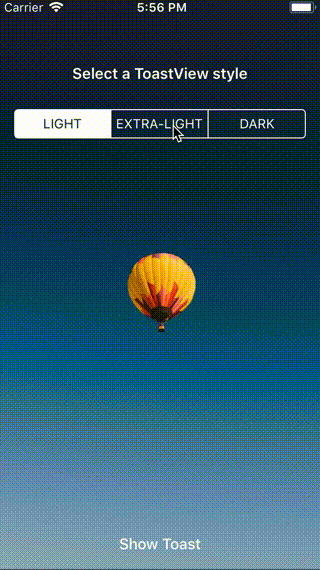

# SKToast

[](http://cocoapods.org/pods/SKToast)
[](http://cocoapods.org/pods/SKToast)
[](http://cocoapods.org/pods/SKToast)

`SKToast` is a simple and light weight Android like toast view for your iOS app written in swift.



## Example

To run the example project, clone the repo, and run `pod install` from the Example directory first.

## Features

- [x] ToastView Customization
- [x] Easy & Quick Integration


## Requirements

- iOS 9.0+
- Xcode 9.1+
- Swift 4.0+

## Installation

### CocoaPods
To integrate SKToast into your Xcode project using CocoaPods, specify it in your `Podfile`:
```ruby
source 'https://github.com/CocoaPods/Specs.git'
platform :ios, '9.0'
use_frameworks!

target '<Your Target Name>' do
pod 'SKToast', '~> 0.1.0'
end
```

Then, run the following command:

```bash
$ pod install
```


### Manual
You can directly add the `SKToastView.swift` source files into your Xcode project.

Include SKToastView wherever you need it with `import SKToast`.

## Author

SachK13, iosdev.sachin@gmail.com

## License

SKToast is available under the MIT license. See the LICENSE file for more info.
